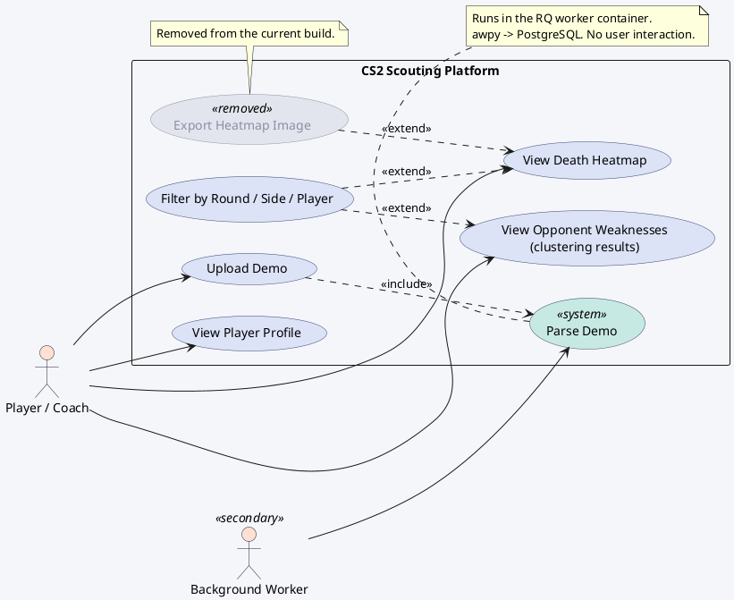
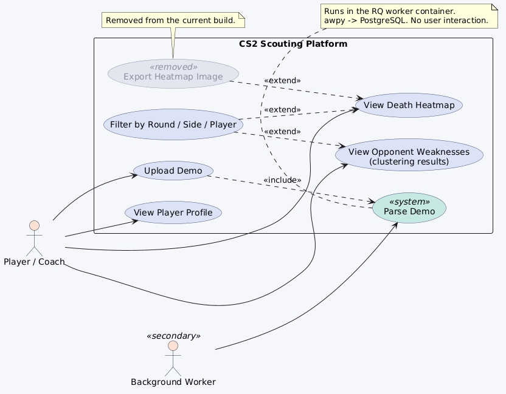

# 1. Use Case Diagram — CS2 Scouting

PlantUML (Mermaid has no native use-case notation, so this one diagram uses PlantUML).

**Who triggers what**

- **Player / Coach** triggers everything they see: upload, browse, filter.
- **Background Worker** is a secondary (non-human) actor. It performs *Parse Demo*,
  which is pulled in by *Upload Demo* through an `<<include>>` — the user never
  starts parsing directly.
- *Filter by Round / Side / Player* is an `<<extend>>`: the heatmap and the weakness
  view work without it, filtering is optional refinement.

> **Note on "Export Heatmap Image":** this use case is marked `<<removed>>`. It existed in
> an earlier build and was taken out of the current one, so it is shown greyed to keep the
> diagram honest about what ships today. Delete the node if the report should only show
> live features.

