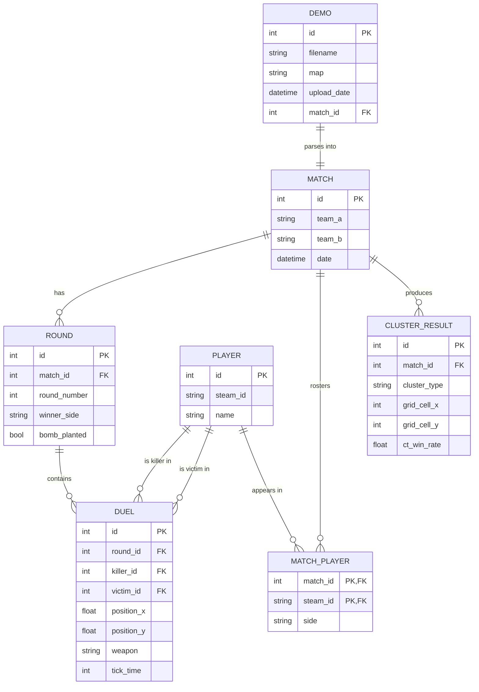

# 2. ER Diagram — CS2 Scouting

Conceptual data model for the report.

**How this maps to the code as built** (`backend/models.py`):

| Diagram entity | Reality |
|---|---|
| `DEMO` + `MATCH` | one table, `matches` (the demo filename is a column on the match) |
| `ROUND` | `rounds` |
| `DUEL` | `kills` |
| `PLAYER` | `players` (keyed by `steam_id`) |
| `MATCH_PLAYER` | `match_players` — the many-to-many join between players and matches |
| `CLUSTER_RESULT` | **not a table** — clustering output lives in `output/grid_ml1.json`, which the API reads and caches |

`DEMO` and `CLUSTER_RESULT` are kept separate here because they are separate *concepts*
in the pipeline even though the storage differs.

