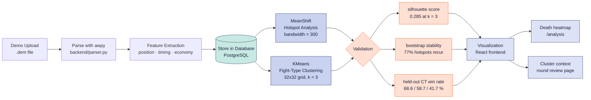

# 3. Data Flow / Pipeline Diagram — CS2 Scouting

End-to-end: a `.dem` file goes in, two unsupervised models run over it, both get
validated, and only then does anything reach the screen.

Real numbers from `output/grid_ml1.json` (50 reference matches on `de_mirage`):
7,158 duels · 17 hotspots · 192 of 341 grid cells pass the 10-duel threshold · k = 3.

