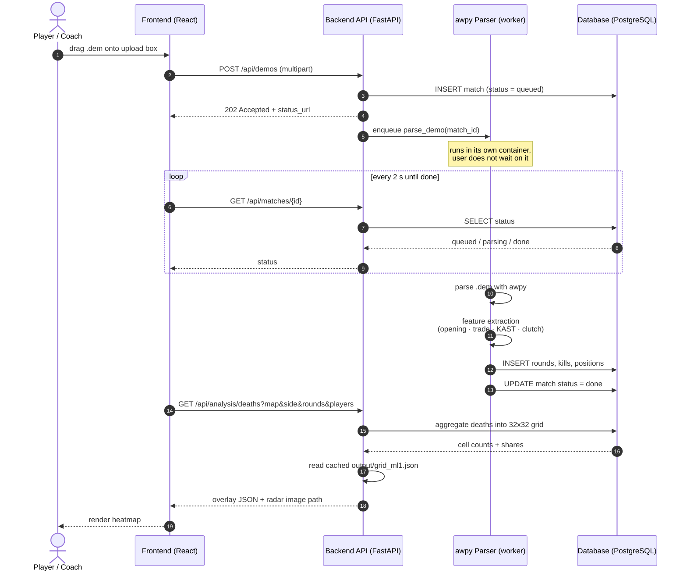

# 4. Sequence Diagram — upload a demo and view results

Matches the shipped behaviour: the upload returns `202` immediately with a status URL,
the worker parses in the background, and the frontend polls every 2 seconds until the
match reports `done`.

