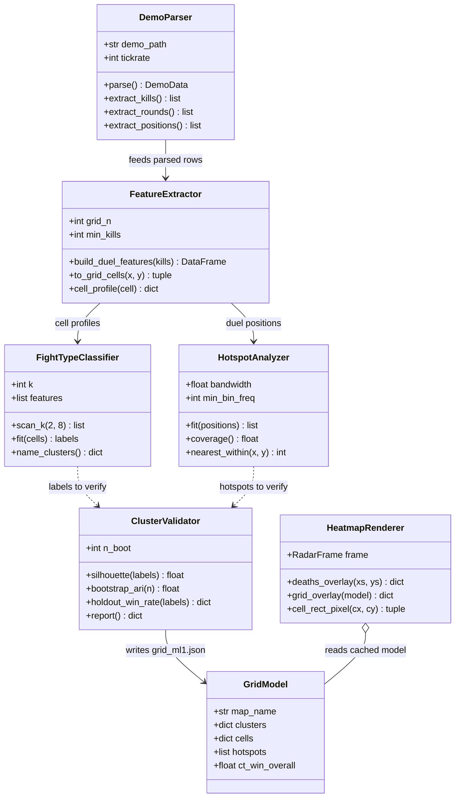
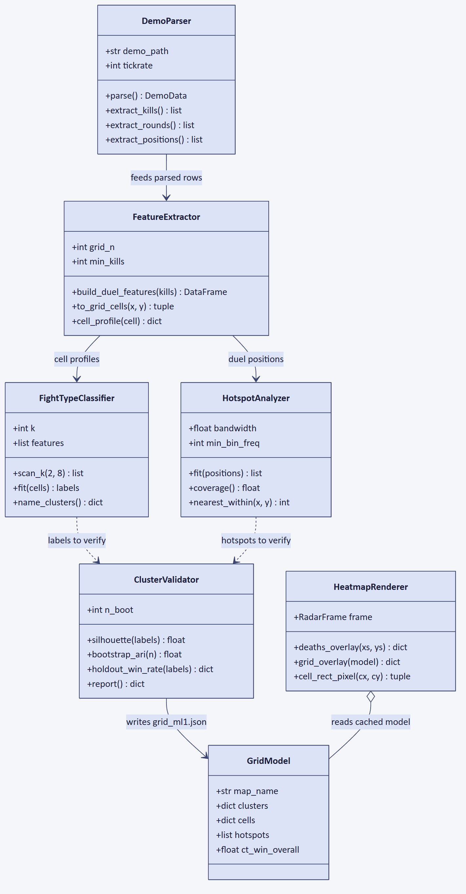

# 5. Class Diagram — backend / analysis modules

The project is written as Python modules rather than a deep class hierarchy, so this
diagram models each module's responsibility as a class. Mapping to files:

| Class in diagram | Where it lives |
|---|---|
| `DemoParser` | `backend/parser.py` |
| `FeatureExtractor` | `backend/features.py` |
| `HotspotAnalyzer` | MeanShift section of `research/grid_ml1.py` |
| `FightTypeClassifier` | KMeans section of `research/grid_ml1.py` |
| `ClusterValidator` | validation section of `research/grid_ml1.py` |
| `HeatmapRenderer` | `backend/review.py` (`deaths_overlay`, `grid_overlay`) |

