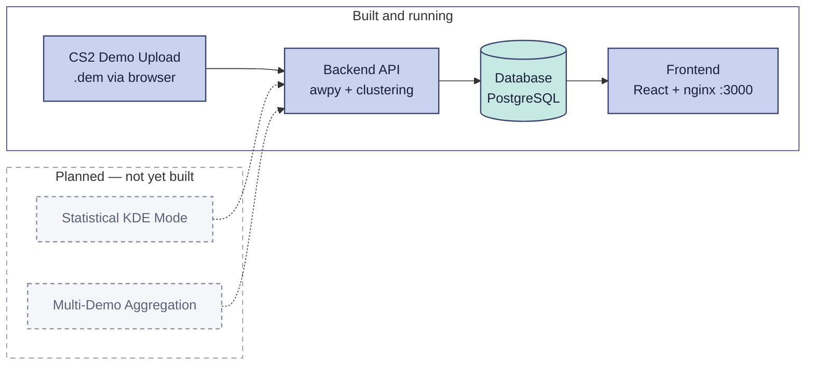
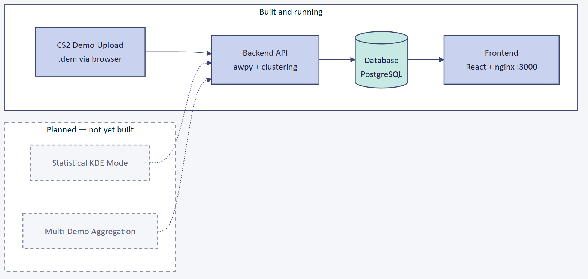

# 6. System Architecture / Component Diagram

Solid arrows are components that exist and run today. Dotted arrows (`-.->`) are
designed but **not yet built**.

```mermaid
flowchart LR
    subgraph BUILT["Built and running"]
        direction LR
        A["CS2 Demo Upload<br/>.dem via browser"] --> B["Backend API<br/>awpy + clustering"]
        B --> C[("Database<br/>PostgreSQL")]
        C --> D["Frontend<br/>React + nginx :3000"]
    end

    subgraph PLANNED["Planned — not yet built"]
        direction TB
        E["Statistical KDE Mode"]
        F["Multi-Demo Aggregation"]
    end

    E -.-> B
    F -.-> B

    classDef built fill:#C9D2EE,stroke:#3B4570,stroke-width:1.5px,color:#1B1F3B
    classDef store fill:#C7E9E3,stroke:#3B4570,stroke-width:1.5px,color:#1B1F3B
    classDef planned fill:#F5F6FA,stroke:#8A8FA3,stroke-width:1.5px,stroke-dasharray:5 4,color:#5B6178

    class A,B,D built
    class C store
    class E,F planned

    style BUILT fill:#FFFFFF,stroke:#3B4570,stroke-width:1px
    style PLANNED fill:#FFFFFF,stroke:#8A8FA3,stroke-width:1px,stroke-dasharray:6 5
```

