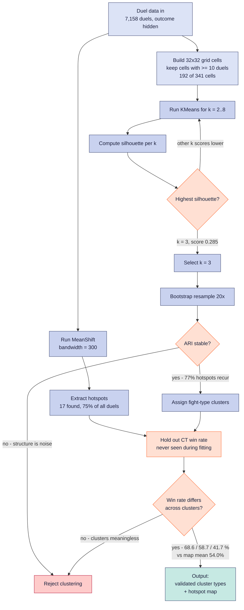

# 7. ML Algorithm / Decision Flowchart

Two unsupervised branches run over the same duel data, then three independent checks
decide whether the structure is real. The CT win rate is held out of both models and
only re-enters at the last gate.

All values are the ones actually produced by `research/grid_ml1.py`
(50 matches · `de_mirage` · 7,158 duels).

