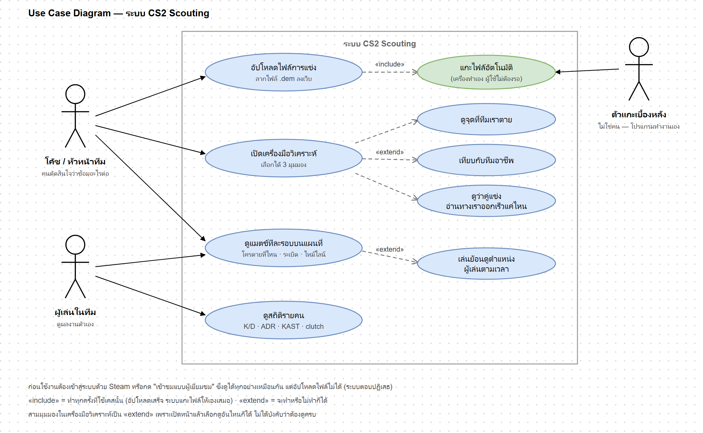
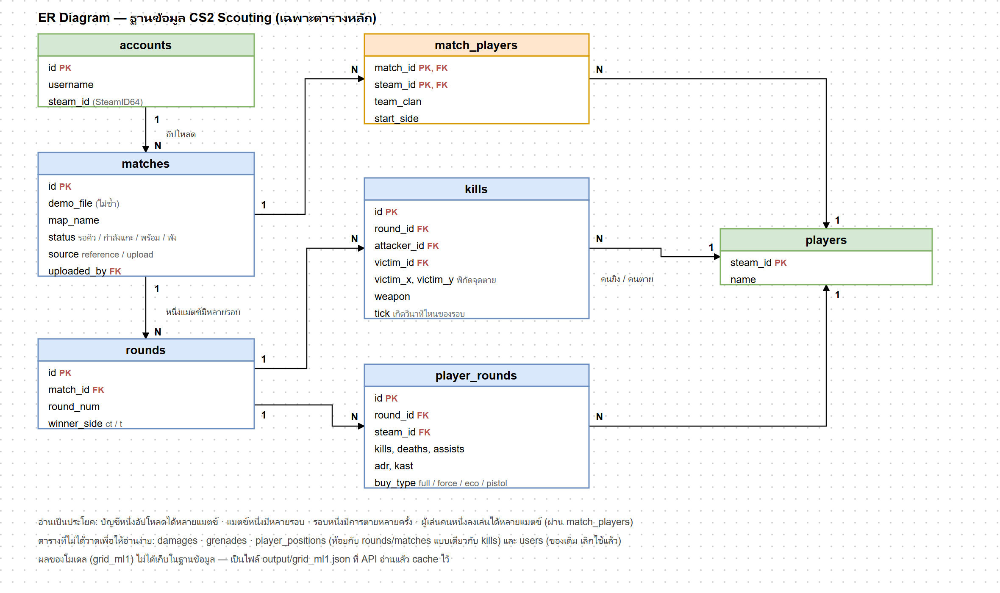
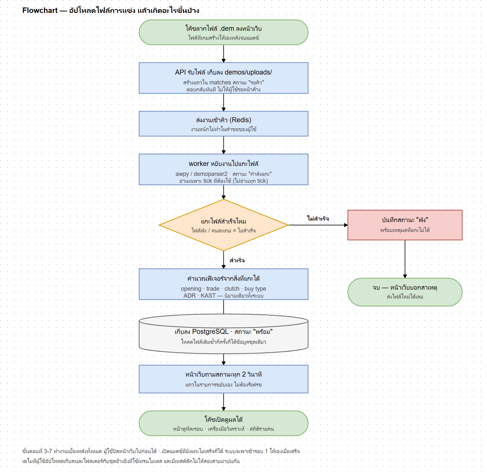
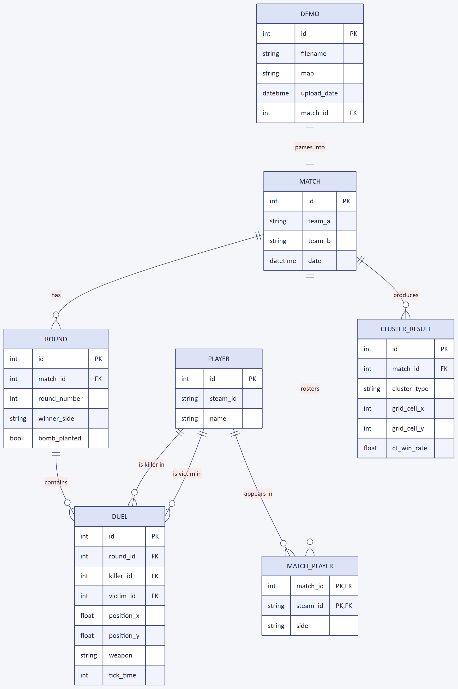
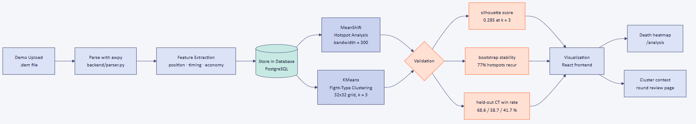
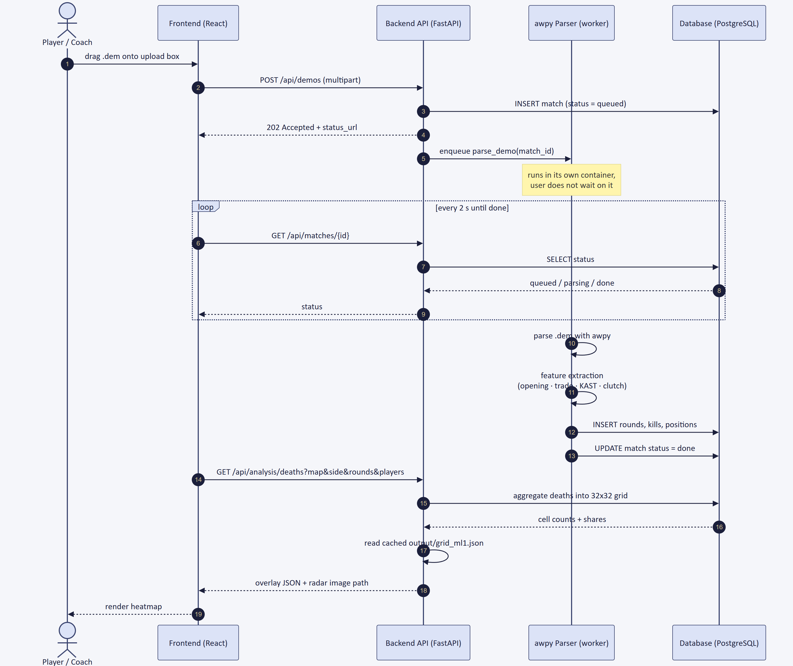
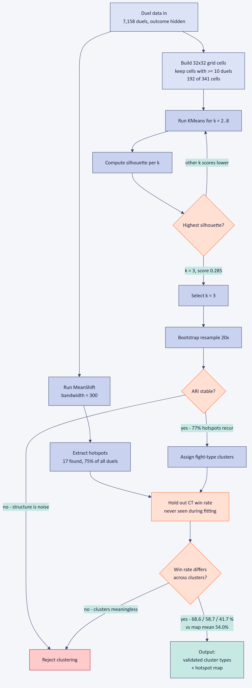

# CS2 Scouting — Documentation Diagrams

Diagrams covering requirements, data, process, and architecture. Each one has an editable
source next to a rendered `.png`, so the images can be dropped straight into a report or
slide deck — either a `.md` holding Mermaid/PlantUML, or a hand-authored `.html` (SVG).

**เริ่มอ่านที่หัวข้อ 0** ถ้าต้องการรูปย่อภาษาไทยสำหรับเล่มรายงาน

All numbers shown in the diagrams come from the real pipeline output
(`output/grid_ml1.json` — 50 reference matches on `de_mirage`, 7,158 duels).

| # | Diagram | Source | Syntax |
|---|---|---|---|
| 1 | Use Case | [01-use-case.md](01-use-case.md) | PlantUML |
| 2 | ER Diagram | [02-er-diagram.md](02-er-diagram.md) | Mermaid |
| 3 | Data Flow / Pipeline | [03-pipeline.md](03-pipeline.md) | Mermaid |
| 4 | Sequence | [04-sequence.md](04-sequence.md) | Mermaid |
| 5 | Class | [05-class-diagram.md](05-class-diagram.md) | Mermaid |
| 6 | System Architecture | [06-architecture.md](06-architecture.md) | Mermaid |
| 7 | ML Decision Flow | [07-ml-flow.md](07-ml-flow.md) | Mermaid |

---

## 0. เวอร์ชันย่อภาษาไทย (ใช้ในเล่มรายงาน / สไลด์)

สามรูปนี้วาดมือเป็น SVG สไตล์ draw.io เรียบ ๆ ตรงกับโค้ดปัจจุบัน — เอาไปแปะได้เลย
แก้ไขที่ไฟล์ `.html` แล้วเรนเดอร์ใหม่ (ดูหัวข้อ "Regenerating the images" ท้ายไฟล์)

### Use Case — [usecase-basic-th.html](usecase-basic-th.html)



สองคนที่ใช้จริง (โค้ช · ผู้เล่น) กับตัวแกะเบื้องหลังที่ไม่ใช่คน
`«include»` = อัปโหลดเสร็จแล้วระบบแกะไฟล์ให้เองเสมอ · `«extend»` = เลือกทำหรือไม่ทำก็ได้ (สามมุมมองในเครื่องมือวิเคราะห์ · โหมดเล่นย้อน)
เรื่องล็อกอิน Steam / โหมดผู้เยี่ยมชมที่อัปโหลดไม่ได้ อยู่ในหมายเหตุใต้รูป
แทนที่ [use-case-th.html](use-case-th.html) เดิม (16 ก.ย.) ที่ยังไม่มีหน้าดูทีละรอบและโหมดเล่นย้อน

### ER Diagram (เฉพาะตารางหลัก) — [er-basic-th.html](er-basic-th.html)



เจ็ดตารางหลักจาก `backend/models.py` พร้อม PK/FK และจำนวนความสัมพันธ์ (1 : N)
ตารางที่ตัดออกเพื่อให้อ่านง่าย: `damages` · `grenades` · `player_positions` (ห้อยกับ `rounds`/`matches` แบบเดียวกับ `kills`) และ `users` ที่เลิกใช้แล้ว
ต่างจาก [02-er-diagram.md](02-er-diagram.md) ตรงที่อันนั้นเป็น**แบบแนวคิด** (มี `DEMO` กับ `CLUSTER_RESULT` ที่ไม่ใช่ตารางจริง) ส่วนอันนี้คือ**ตารางจริงในฐานข้อมูล**

### Flowchart (อัปโหลด → ดูผล) — [flowchart-basic-th.html](flowchart-basic-th.html)



เส้นทางของผู้ใช้หนึ่งคน ตั้งแต่ลากไฟล์ `.dem` ลงเว็บจนเปิดดูผลได้ พร้อมทางแยกตอนแกะไฟล์ไม่สำเร็จ
ต่างจาก [03-pipeline.md](03-pipeline.md) ตรงที่อันนั้นเล่าสาย **ML** (MeanShift/KMeans + สามด่านตรวจ) ส่วนอันนี้เล่าสาย **การใช้งานจริง**

---

## 1. Use Case Diagram


The Player/Coach triggers upload, browsing and filtering directly, while *Parse Demo* is an internal job the background worker performs through an `<<include>>` from *Upload Demo*.

## 2. ER Diagram



Conceptual data model — one match holds many rounds, each round holds many duels, and players connect to matches many-to-many through `MATCH_PLAYER`.

## 3. Data Flow / Pipeline Diagram



A `.dem` file is parsed, turned into features, stored, then fanned out to MeanShift and KMeans — and nothing reaches the screen until all three validation checks pass.

## 4. Sequence Diagram



Upload returns `202` immediately and the frontend polls every 2 seconds while the worker parses in the background, so the user never waits on a blocking request.

## 5. Class Diagram


Each analysis responsibility is its own module: parsing feeds feature extraction, which feeds the two clustering models, which both hand their output to the validator.

## 6. System Architecture / Component Diagram


Solid arrows are the four components running today; the two dotted components — Statistical KDE Mode and Multi-Demo Aggregation — are designed but not yet built.

## 7. ML Algorithm / Decision Flowchart



The clustering only survives if it clears three independent gates: silhouette picks `k = 3`, bootstrap resampling confirms stability, and the held-out CT win rate separates the clusters (68.6 / 58.7 / 41.7 % against a map mean of 54.0 %).

---

## Regenerating the images

Mermaid diagrams (needs `@mermaid-js/mermaid-cli`):

```bash
mmdc -i 03-pipeline.md -o 03-pipeline.png -b "#F5F6FA" -s 2
```

The use case diagram is PlantUML. With Java installed:

```bash
java -jar plantuml.jar 01-use-case.md -o .
```

Without Java, paste the `plantuml` block into <https://www.plantuml.com/plantuml> — that
is how `01-use-case.png` in this folder was produced.

## Also in this folder

Three hand-built SVG diagrams used inside `docs/progress1-slides-v3.pptx`. They are plain
HTML with inline SVG, so they can be opened in a browser and edited directly:

- `architecture.html` — the same architecture view, styled to match the slide deck
- `data-pipeline.html` — reference vs. upload data separation
- `validation.html` — the three validation gates
